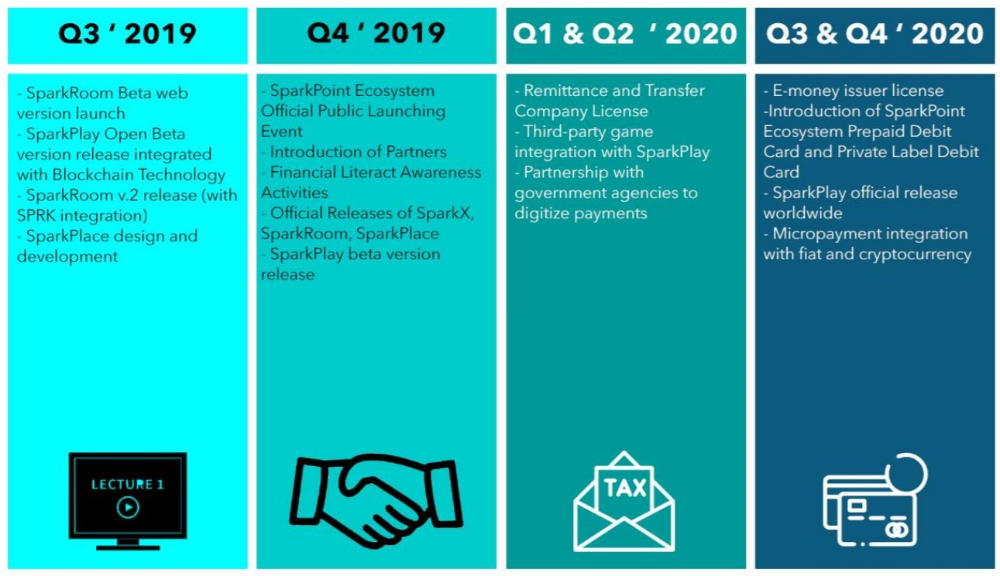

# SPARKPOINT ECOSYSTEM 

SparkPoint Ecosystem Whitepaper Version 2.1

## Table of Contents

* [IMPORTANT NOTICE](#important-notice)
* [Vision & Mission]()
* [Introduction](#introduction)
* [Problems](#problems)
* [Market Opportunities](#market-opportunities)
* [Solution](#solutions)
  * [SparkEarn](#sparkearn)
  * [SparkLearn](#sparklearn)
  * [SparkPlace](#sparkplace)
  * [SparkPlay](#sparkplay)
* [SparkPoint Token](#sparkpoint-token)
  * [Mechanism](#sparkpoint-token-mechanism)
  * [Transactional Usage](#transactional-usage)
  * [Rewards Program](#rewards-program)
* [Roadmap](#roadmap)
* [Transparent Reports](#transparency-reports)
* [Buyback and Repurchase Plan](#buyback-and-repurchase-plan)
* [The Team](#the-people-behind-sparkpoint-ecosystem)
* [Support](#official-support-channels)

## IMPORTANT NOTICE

PLEASE READ THE FOLLOWING SECTIONS CAREFULLY NAMELY “DISCLAIMER’, “RESTRICTION”, “REPRESENTATION AND WARRANTIES BY YOU", “NO OFFER OF SECURITIES OR REGISTRATION”, AND “RISKS".

DISCLAIMER 

This document is a technical whitepaper setting out the current and future development of SparkPoint Ecosystem (SPE) and is for information purposes only. The products and/or platforms cited in this whitepaper are currently under development. SparkPoint Ecosystem makes no warranties as to the successful development or implementation of such platforms and innovations or achievements of any other actions specified in this paper.

SparkPoint Ecosystem shall not be liable for any indirect, unusual, minor, substantial or other losses of any kind, in contract or otherwise (including but not limited to loss of revenue, income or profits, and loss of use or data), arising out of or in connection with reliance on this Whitepaper by you.

RESTRICTION

The distribution of this whitepaper or any part thereof may be restricted by laws and regulatory requirements in some location. You hereby warrant that possessing this whitepaper you are informed or knowledgeable of any restriction or regulation the country or state you are residing and at your own expense and SparkPoint Ecosystem is not liable.

REPRESENTATION AND WARRANTIES BY YOU

By accessing or possessing any information in this whitepaper, you represent and warrant to SparkPoint Ecosystem as follows:

a. You acknowledge that SparkPoint Ecosystem's token - the SparkPoint Token (SRK) does not constitute securities in any form in any jurisdiction;

b. You agree that by distributing or dissemination this whitepaper or any part thereof, you examined and complied to all applicable law, regulations or rules in your jurisdiction without liability to SparkPoint Ecosystem;

c. You agree that in any case where you wish to purchase SRK that SRK are not to be interpreted or classified as:

&nbsp;&nbsp;i. Any kind of currency other than cryptocurrency;

&nbsp;&nbsp;ii. Stocks or shares issued by any person or entity;

d. Rights, options or derivatives of such stocks or shares;

&nbsp;&nbsp;i. Any kind of currency other than cryptocurrency;

&nbsp;&nbsp;ii. Stocks or shares issued by any person or entity;

&nbsp;&nbsp;iii. Rights, options or derivatives of such stocks or shares;

&nbsp;&nbsp;iv. Units in a collective investment arrangement;

&nbsp;&nbsp;v. Unitsin a business trust;

&nbsp;&nbsp;vi. Any other security or class of securities.

e. You understand that in the case you wish to purchase SRK, there are risks associated with it
including the SRK, SPE and its platforms.

NO OFFER OF SECURITIES OR REGISTRATION

This whitepaper is not an offer document of any sort and is not intended to constitute an offer of securities or a solicitation for investments in securities in any jurisdiction. No entity is bound to enter into any contract or legally binding promise. Any agreement in relation to sale or purchase of SRK is to be governed by only the Terms and Conditions (T&C's) and no other document.

RISK

Potential purchasers of SRK should consider and evaluate all risks and uncertainties associated with SparkPoint Ecosystem, SparkPoint Token and all information stated in this whitepaper. If any of suck risks develops into actual events, the business, financial condition, political and economic situation in your jurisdiction, international war or acts of terrorism, results of operations, all forecasts of SparkPoint Ecosystem could be unfavorably affected. In such cases, you may lose all or part of the value of SparkPoint Token.

## INTRODUCTION

The market has a fast-growing demand for fast, reliable, comprehensive, accessible, and low transaction fee payment channels. Existing payment options like money remittance center, online banking and e-wallet for fiat currencies still lack of these features and benefit. Now, people are looking for an alternative which is accessible to all regardless of social status, gender, nationality and location while keeping their sensitive personal information safe from security threats and fraud. Also, an alternative payment channel that is rewarding.

SparkPoint Ecosystem is a ground-breaking payment gateway alternative that will not just provide convenience to the market but will also educate the people on financial literacy and satisfy entertainment needs while rewarding its users. An all-in-one web-based and mobile application using the Blockchain Technology and is integrated to use cryptocurrencies and fiat currencies.

With SparkPoint Ecosystem, people can now settle utility and credit card bills, pay tuition fees, insurance premiums and online purchases, remit both fiat and digital currencies, and pay for government mandated taxes, licenses and transactions in an incorruptible, transparent and fast manner.

SparkPoint Ecosystem as an all-in-one platform will have four divisions namely, SparkEarn, SparkLearn, SparkPlace and SparkPlay.

SparkEarn will provide alternative payment gateway with real-time to almost real-time payment and exchange transaction posting with no to minimal transaction fee{s). This will be made possible by its native token, SRK, that will stimulate the internal and external transactions. As an innovative financial platform, SparkPoint Ecosystem would reach the financially excluded majority population of the world particularly in the Southeast Asia.

SparkLearn is an integrated library of articles, learning materials and modules to promote financial literacy and stimulate financial inclusion to the mass population. Aside from formal financial education, this also aims to encourage the use and spread the benefits of cryptocurrencies and Blockchain technology.

SparkPlace is an in-application marketplace where user-members can sell and purchase products and services without using other intermediaries to list products and accept payments. This will be the most inclusive marketplace accepting wide range of cryptocurrencies converted to SparkPoint Token or by using fiat currencies. Different from the existing marketplaces, real rewards will be given to loyal customers and merchants, a reward that has real value and can be converted to fiat currencies.

SparkPlay, a division that will let the users earn rewards by just playing Blockchain integrated games. A truly unconventional way of playing where users will be rewarded by tokens that has real world value which they can later convert to other cryptocurrency or fiat currencies and use in other platforms.

## PROBLEMS

1. A LOT OF PEOPLE IN THE WORLD ARE STILL FINANCIALLY EXCLUDED.

There are seven billion people in the world and as of 2011 around 2.5 billion working adults are unbanked or doesn’t have any quality financial services - 2.2 billion of which came from countries in Africa, Asia and Latina America leaving them to be reliant on cash economy.

Several factors resulted to these large number of financially excluded or unbanked population including but not limited to:

* Low income families’ incapability to meet minimum initial deposit and maintaining balance for bank accounts
* High transaction fees, charges and interest rates
* Lack of financial information
* Self-exclusion
* Disability &
* Geographical Factor

Being financially excluded bars people to basic financial services such as savings account, credit cards, cash, car and housing loan, safe banking and digital payments. Also, having no access to these benefits will force an individual to borrow money from non-bank lenders and illegal loan sharks with a possibility of fraud, redundancy of fees and unexpected costs.

2. HIGH OR EXPENSIVE FEES FOR REMITTANCES, MONEY TRANSFER AND CRYPTO-EXCHANGE TRANSACTIONS.

International Remittances

A 2017 infographic published by the World Bank shows that international remittances totaled to 585 billion USD with 73% of total remittances went to developing countries. The fees for remittances averages at 7.32% and banks remain to be considered as the most expensive remittance channel or service provider which charge 11.18 percent of the money sent.

In Southeast Asia, largest inbound markets for remittances are Indonesia, Vietnam, Myanmar and Philippines; large percentage of the senders are overseas workers that pays up to 10% of the money they send for each transactions.

Domestic Remittances/Money Transfer

Money transfer and domestic remittance is an integral part of cash economy in developing countries like the Philippines especially for individuals working far from home (internal migrant).

According to 2010 Census of Population and Housing (CPH) of the Philippine Statistics Authority, 1.4 million Filipinos are moving to a different region. CALABARZON (Region IV-A), Metro Manila (NCR) and Central Luzon (Region I11) are the top destinations of long-distance migrants which covers 27.7%, 19.7% and 13% of total number of these migrants respectively.

Economical need is one of the top reason why individuals are migrating to a different region especially in these top destinations where higher paying jobs are present. With these 1.4 million Filipinos moving from one place to another leaving their family and relatives behind, money transfer industry in the Philippines is vital however, the existing services costs each sender from 3 to 6 percent of the amount being sent depending on the recipients’ location.

Aside from these high transaction fees, long lines and waiting time for transactions are additional burden to both the sender and the recipient. 

Cryptocurrency Exchange

There are more than approximately 2,000 cryptocurrencies circulating in the world today, however, not every cryptocurrency is available from every exchange. Several payment gateways require both merchant and the payer to select the same payment mechanism and this limits the power of one user to another and reduces the value of the cryptocurrency by using several intermediaries before an exchange has to be successful.

3. POOR CUSTOMER SERVICE

Fraudulent activities, declined transactions, system going offline, and unauthorized charges are just few of several concerns of any financial institution customers. Though there are many ways to ask for customer support on this digital age, resolving customers’ concern still takes a long time and involves too many processes and documents. These lead customers just to leave it unresolved than to spend time and money more than the value of the time and money they already lost, and/or customer will leave the institution due to distrust and go to another and so on.

Due to complicated requirements to open an account and high minimum deposit leaving the low income families behind, this kills the opportunity to have more potential investors or depositors. This is the type of “customer service” that is profit-driven rather than being customer-centric.

4. LACK OF FINANCIAL LITERACY AND OVERALL AWARENESS ON BLOCKCHAIN TECHNOLOGY.

Lack of financial literacy

Without sufficient financial literacy, people won't be able to identify financial products or services that is suitable to them. This is also a factor why individuals would prefer to save at their own house instead of opening a bank account.

Lack of financial literacy gives people no idea on the importance of banking and using financial services like loans and credit cards.

Lack of awareness on Blockchain Technology

Blockchain technology was first used in 1991 and formally introduced as a financial technology in 2008. However, vast majority of people are still not aware on how this technology works. Being unaware of the benefits of this technology, people either refrain from using it or just having no interest in it at all taking the passive approach.

5. NO EFFICIENT KNOW-YOUR-CUSTOMER (KYC) VERIFICATION METHOD

It is a must and understandable for financial institutions to verify their potential customers’ information, however, with inefficient and near to obsolete KYC method, many have switched banks or don’t open a bank at all.

According to a Thomson Reuters’ survey in 2017, KYC onboarding process takes so long with an average of 24 days to complete the customers’ onboarding process. Some customers also felt that their privacy was being violated since different and more and more information are being asked.

In the Philippines, some banks may just ask for two valid ID’s, initial deposit and proof of billing while most banks require the proof of billing to be under the applicant’s name and proof of income. In a country like the Philippine, renting an apartment or a room is very common even for working individuals which they will not be able to provide proof of billing under their name. And also, not all interested applicants are working, some are just students living away from home and is not capable of showing a proof of income.

These are the top hindrances why 75% of the Filipino adults don't have an access to formal financial services.

6. NO RETURN OF INVESTMENTS FOR GAMERS

All of digital phone users are downloading application and games through App Store for iOS and Google Play for Android, and in-app purchases are also in-demand for gaming applications like MOBA, Casino-inspired games and others. With the conventional gaming application with in-app purchases, money has only one way but go to the developer or the owner of the game.

## MARKET OPPORTUNITIES

The global market using digital payment is expected to have a compound annual
growth rate of 14.1% from 2018 to 2023. With the emerging merchants and billers
who integrate with digital and cashless payment options, payments by cash will
soon be out of style.

In 2017, about 1.7 billion people in the world purchased products using the internet with a total of 2.3 trillion USD sales in the e-commerce industry. Asia Pacific is claims the biggest chunk of this market which covers 12.1 percent of the whole e-retail sales. By the year 2021, e-commerce will be seen to produce almost double the sales with projected amount of 4.48 trillion USD e-retail sales.

In 2016, it was projected that in-app purchases will reach $37 billion for 2017. With these in-app purchases, North Americans buy the highest amount when they buy coins, gems or diamonds with the applications they use. Wherein, Asians spend 40% more on in-app purchases compared to the rest of the world.

People born between 1980 - 2000, also known as millennials or Generation Y is approximately 27% of the global population treat technology as a vital part of their lifestyle. This population group uses technology on most of their everyday routine, from socializing, reaching love ones, school and work research, job application up to purchasing gadgets, food and groceries. They are the ones who constantly use laptop or computers, smartphone and internet to do their daily tasks and errands conveniently. In fact, this opened doors for the retailers and other service providers to target consumers where they spend most of their time, the internet.

Based on the latest world internet usage and population report, as of June 30,2018, 55.1% of the world’s population or 4.2 billion people are using internet. Asia being on the top spot which involves 49% of the internet users’ population in the world, while 67 million people from the Philippines is using internet as of December 2017.

By 2019, smartphone users in the world are expected to pass the five billion mark. At present, about 90% of the millennial population possess smartphone and use it throughout their daily routine. Online merchants like Amazon with a global scale operation, Lazada, Zalora, and Shopee which operates in the Asia Pacific offers different payment options including card payments, cash on delivery, Paypal and their own e-wallet. This gives customer convenience of shopping.

According to a March 2016 survey on mobile shopping penetration worldwide, 46% of internet users in Asia and 28% from North America had used their mobile phones and/or tablet computer to purchase or shop. Ina 2017 report, 11% of online shoppers or consumers use their smartphone to shop online on a weekly basis.

Recently, McDonalds food chain introduced the latest technology in their new stores in the Philippines - the McDonalds NextGen stores where consumers will be able to conveniently order via self-service and customer has an option of paying cashless.

With the entire world even the developing countries in Asia and Africa are shifting to technologically-driven payment options to complete their transaction, the use of digital currencies such as Bitcoins and Ethereum are also rising.

SparkPoint Ecosystem sees these financial and market trends as opportunities to educate the masses about financial literacy and encourage the unbanked population to use alternative payment gateways to complete their transaction like shopping online, dining, fund transfer, loan and bills payment.

## SPARKPOINT ECOSYSTEM AS A SOLUTION
### Reinventing Digital Payments
### Building a Better Future

## SOLUTIONS

SAFE, FAST AND SECURE TRANSACTIONS

The SparkPoint Ecosystem is adopting the Ethereum Blockchain to transact within the platform especially for the SparkEarn and SparkPlace. This ensures that the transaction will be secure, fast and transparent in manner. This technology allows two individuals or entities to perform trading without the need of an outside mediator such as commercial banks, remittance center, therefore eliminating the overhead fees.

Blockchain technology is an open-source digital ledger that contains series of blocks that holds data of the transaction like the sender, receiver and the amount. This technology is known for its high security against fraud, scam and hacking.

According to a report by the World Bank Development Research Group in 2014, digitizing payments will help to lower cost and physical barriers that will suddenly help to increase the number of people with access to financial services through mobile phones, computer, and retail point-of-sales with the support of financial consumer protection network.

Digitizing payments and using Blockchain technology as its core will dramatically lessen the intermediaries between two point of transactions (sender and receiver) that usually is the largest part of operational cost with the existing and traditional payment scheme. Since intermediaries are being eliminated slowly, this will fasten the transaction from request to approval and will lower the risk of potential breach of information.

While this technology provides lower-cost and time-saving benefits to the consumers, this will also provide the same benefits for enterprises and financial institutions by using the available data such as payment transaction and analytics to get more accurate customer profiling, credit risk assessment and potential fraud detection and prevention.

Small and Medium Enterprises will also benefit in this technology especially ones who are engaged in e-commerce by getting the payments by their customers in a very much lesser time once intermediaries and other decade-old KYC verification process has been eliminated with the use of available data in the Blockchain.

WEB-BASED AND MOBILE APPLICATION

SparkPoint Ecosystem’s platforms can be accessed through web and the SparkPoint mobile application. Both website and mobile application designed with a user-friendly interface for easy navigation and transaction. SparkPoint Ecosystem’s web and mobile application version will support both fiat and digital currency.

With SparkPoint Ecosystem, users can cash-in and cash-out fiat currencies
through the following but not limited to different partner channels like bank,
brick-and-mortar centers, remittance centers, merchant stores and other money
agents. The e-wallet is also integrated to cryptocurrency exchanges to execute
buying, selling and exchanging cryptocurrencies using fiat currencies and vice
versa; also, to maintain the live exchange rate of SparkPoint Token (SRK) and other
to facilitate the conversion of SparkPoint Token with other cryptocurrencies like
Ethereum (ETH) and Bitcoin (BTC) and vice versa.

The platform is protected with e-mail and phone number verification, and one-time password (OTP) on top of the user’s own security key. For additional security, users have the option to activate Google authentication factor.

Inter-transfer of fiat currency and SPK Token is free of charge; users will only have to pay for the network fee for transferring other cryptocurrency.

EFFICIENT KNOW-YOUR-CUSTOMER METHOD

SparkPoint Ecosystem will introduce an efficient verification method for clients who will use the platform for financial transactions. There will be different tiers for verification that comes with different transaction limits and access to platform. Each tier will be identified as “Rank” and explained as follows:

*USD 1=PHP 50

SparkPoint Ecosystem will introduce a more efficient and feasible verification method in line with KYC standards of each country (e.g. for Philippines, Central Bank of the Philippines guidelines).

## SparkEarn™

INNOVATIVE, AND LOW-COST ONLINE PAYMENT GATEWAY

Establishing an alternative online payment gateway like SparkPoint Ecosystem will help to achieve the goal for everyone to be financially included. E-wallets and payment gateways will encourage more individual to fully participate in the formal financial system. Achieving this goal around the world will not only benefit the unbanked individuals but also small-medium enterprises up to big enterprises.

Financial inclusion will open opportunities to improve the standard of living for most of the people especially the currently unbanked population. With this alternative financial gateway, financial institution and other financial service providers will be able to reach the marginalized without compromising the risk of their investment returns.

Giving the unbanked population an access to financial services will stimulate positive economic activity since the formerly unbanked population who engages in illegal loan sharks will now be able to access financial services that suits for them like short-term loans, business loans, insurance, and debit and credit services. With low-cost online payment gateways, we will serve as the bridge to provide these formal financial services to the majority of the people while giving them these services at affordable terms, available with proximity to their geographical location, and regulated to protect both consumers and providers.

SparkPoint Ecosystem will partner up with  local banks, brick-and-mortar merchandisers, e-commerce platforms, loan providers, remittance centers, schools and universities, utility and telecommunication services providers and with the government to provide seamless payment and remittance transaction using the e-wallet or the payment processing platform.

PEER-TO-PEER TRANSFER AND REMITTANCE

Since  SparkEarn™ is also cryptocurrency exchange integrated, users can process an direct online transfer of both fiat and digital currencies based on Peer-to-Peer (P2P) transactions in the network instantly and with zero transaction fees with both having the sender and recipient using [ SparkPoint Ecosystem network. In any case that either the recipient is not yet using the SparkPoint Ecosystem, a discounted fee based on the regular rate will be charged.

This would boost mass adoption and will lead to charge-free and seamless transactions moving forward.

DIGITAL CURRENCY EXCHANGE INTEGRATION

With the growing number of people engaging in cryptocurrency exchange, they can convert one cryptocurrency to another at lower rate using SparkEarn. With the web-based and mobile wallet, users can purchase and sell cryptocurrency by using fiat currency and to convert SparkPoint Tokens with other major cryptocurrencies like BTC and ETH.

## SparkLearn™

SparkPoint Ecosystem will launch an E-learning facility amidst the challenge of financial illiteracy the world is facing today.

SparkLearn is an in-application portal which contains articles may it be news, informational or opinion that aims to provide financial literacy to the masses about the importance of financial inclusion, financial management and the benefits of Blockchain technology.

SparkLearn has tailor-fitted e-learning modules concerning financial management from personal to commercial level, investments, credit management and savings. There will also be a special set of module that will tackle Blockchain technology in order to increase awareness and mass adoption of this innovative technology. There will be targeted financial literacy and capability training depending on the consumers’ preferences and transactions they most use. Adequate information and education through e-learning will produce great positive impacts not only for the consumers, but also for the financial market. A financially educated individual is more likely to use financial services like savings, payment gateway and credits.

The portal will release an article regularly with a certain interval and depending on the most talked topics by users in different platforms like the forum site, social media and tickets submitted by the users.

Articles published on this section are written by our very own financial advisors, technical writers and contribution from the consumers.

BLOCKCHAIN INTEGRATED E-LEARNING SYSTEM

SparkLearn will be open to all interested contributors and instructors. Fees for each courses will be determined by the course provider. High contributing instructors and students will receive SRK tokens as rewards which they can use to purchase courses or convert to fiat and other cryptocurrency.

At the end of each courses or programs, there will be an assessment for each student for the learning and a certificate will be issued through the Blockchain technology. Students will be asked to rate the course and the instructor upon completion and this will help the community to choose the best courses and programs in the platform.

As for the instructors and course providers, badges and certificates will be given depending on each category like tenure, readership, and number of courses contributed. All certificates and badges will be issued through the Blockchain technology, in this way, tampering, falsification and manipulation of information will be prevented.

## SparkPlace™

The SparkPoint E-commerce platform is a marketplace driven by businesses and consumers. A Business-to-Consumer (B2C) platform where participating merchants can sell myriad of products ranging from electronics, fashion and clothing apparel, books, and more to other reselling merchants or end-users. This will also be integrated to perform Consumer-to-Consumer (C2C) transactions where purchasing and selling between consumers can take place.

The SparkPoint E-commerce platform will primarily use the SparkPoint Token based on Ethereum Blockchain Technology. Through the decentralized ledger system, participating merchants and customers can use the SparkPoint Token for the trading practice without the intervention of third-party payment processor and avoiding additional transaction fees on top of the product’s value. Thus, this will lead to cheaper, faster and safer transaction for each user at the SparkPoint e-commerce platform.

SparkPlace will be presented as SparkPoint’s Marketplace where merchants can sell their products to the users of the application without having to negotiate the fees from other third-party service providers for the payment and listing.

To protect each buyer against counterfeited products, random test orders will be done regularly by our “mystery shoppers”; merchants that will be proven selling counterfeited products or posting false advertisements will be sanctioned. In the same way that we want to protect our sellers from bogus buyers, only users with Rank 2 verification are allowed to use the SparkPlace.

SparkPoint will build partnership with different shipping service providers to lessen the cost of shipping a product and also to properly handle returns and exchange of goods.

SparkPlace will generate its revenue by launching campaigns, advertisements
and prioritization strategy for each participfiing merchants. A subscription fee and
other appropriate fees will be charge by then in the form of the SparkPoint Token.

## SparkPlay™

SparkPlay is an application and gaming store of the SparkPoint Ecosystem which will primarily use SparkPoint Token as its game and store currency. Games and application which will provide rewards with real world value to users and gamers. With SparkPlay, mobile spenders and gamers will earn rewards while they enjoy.

Unlike the traditional gaming application in the market, games launched in SparkPlay is integrated with Blockchain technology. All in-app purchases like chips, gems, diamonds and coins will be made possible by SRK and all game credits they won and earned while playing can later be converted to SRK and cashed-out as fiat as return of their investment on the game.

Cryptogames are the solution to consumers’ boredom and loss of money due to in-app purchases without real world value. Users will also be able to earn rewards by levelling-up, winning games and by trading items in the platform.

SparkPoint Ecosystem will be working with small to big game developers to provide the best experience to our user-members.

## SPARKPOINT TOKEN
### MECHANISM AND USAGE
### Mechanism | Transaction | Rewards

### SparkPoint Token Mechanism

Token Name:
&nbsp;&nbsp;SparkPoint Token

Symbol:
&nbsp;&nbsp;SRK

Decimal:
&nbsp;&nbsp;18

Blockchain Information:
&nbsp;&nbsp;ERC-20 (ETH)

Total Supply:
&nbsp;&nbsp;20,000,000,000

### SparkPoint Token Usage
SparkPoint Token (SRK) is the SparkPoint digital coin based ERC-20 token standard following the Ethereum Blockchain. SRK is designed to power the four different platforms in the SparkPoint Ecosystem, viz., SparkEarn, SparkPlace, SparkPlay & SparkLearn being the digital wallet, e-commerce platform, crypto-gaming platform & e-learning portal respectively.

It is the fundamental component that gives life to the SparkPoint Ecosystem. Anyone can participate and do business in the different platform by purchasing SRK in the market. With growing number of users and traders using the platform, there will be a higher demand for the token. As the number of SRK tokens are limited, higher demand with a shorter supply and development of SparkPoint decentralized ecosystem will continuously result to appreciation of SRK token value in the market.

CRYPTOCURRENCY EXCHANGE
Trade your SRK to other cryptocurrency like BTC, ETH, XRP and others within SparkEarn and vice versa. You may also convert your SRK to fiat currency vv.

PAY BILLS AND BUY TOP-UP LOAD
Use your SRK to pay utility bills, credit card bills, tuition fees and the likes as well as purchase top-up load for your mobile phone or gaming account.

PEER-TO-PEER TRANSFER
Pay your friends, send SRK as gift and all at SparkEarn and receive SRK as well and convert to fiat currency later on.

BUY GOODS OR RENT SERVICES
Use SRK to pay for goods and services sold at SparkPlace

ENROLL AND GET CERTIFIED
Enroll to premium courses in SparkLearn by certified instructors, pass the assessment and get certified. Pay for your tuition using SRK instead of fiat currency.

PLAY, PAY AND GET PAID
With SparkPlay, be entertained, pay for in-app purchases using SRK and get rewarded with real world value and convert it to SRK to earn.

### TRANSACTIONAL USAGE

SRK will be utilized to pay for transaction fees in the SparkEarn ecosystem and each user is entitled with at least 50% discount on transaction fees. Hence, this would make the SparkPoint Ecosystem to be the cheapest financial service platform in the market. Every user can avail the discounted transaction fees as long as they have an existing SRK balance on their SparkEarn wallet.

### REWARDS PROGRAM

Every member of the community who contributes to a healthy and firm development of the SparkPoint Ecosystem are well appreciated and will be rewarded in the form of SparkPoint Token (SRK). This will ensure the continuous promotion, use and growth of demand of the SRK in the market. The SRK don’t have any expiration date and will be useable and convertible as long as the account is not in dormant status for two years

SPARKPOINT ECOSYSTEM REWARDS PROGRAM

### SPARKPOINT ECOSYSTEM
#### AFFILIATE PROGRAM

To encourage more users and subscriber of the SparkPoint Ecosystem, each user-member who will reach Rank 2 verification will receive a specific amount of reward token. In addition, every Rank 2 verified user-members and their successful referral that will reach Rank 2 verification level will also receive reward token as an appreciation.

### SPARKEARN
#### REBATE PROGRAM

Every time a user-member will use SparkEarn platform to pay bills and other micropayments, they will receive a corresponding reward token depending on the amount of the transaction paid which they can later use to purchase at the SparkPlace, convert to other cryptocurrencies or fiat currency and cash-out in the future.

### SPARKPLACE LOYALTY PROGRAM
#### LOYALTY PROGRAM

Reward SparkPoint Token (SRK) will also be utilized under the SparkPlace customer loyalty reward program. An innovative marketing solution to make the merchant and sellers that they are being valued and to build meaningful relationship with the user-members that will help to the growth of merchant-member sales and the use of the platform.

Customers can earn rewards in the form of SRK for every transaction at the SparkPlace. Earned SRK can be used to redeem products, as coupon when purchasing and can be converted to other fiat and cryptocurrencies. They can also leave it on the open market for token value appreciation.

With this reward token, customers will be accustomed to use SparkPlace for their online shopping and get instant rewards without doing any troubling claiming steps. With this flexible reward system that let them liquidate their rewards by using for a purchase, converting to fiat or cryptocurrencies and by participating in the digital currency exchange market.

For participating merchants, they would be able to provide loyalty program to their customer without picking out big amount of investment from their pocket.

### SparkLearn
#### CONTRIBUTION PROGRAM

The SparkLearn aims to increase the financial literacy of the people around the world and this will be done by the help of other user-members also. Anyone who uses the SparkPoint Ecosystem is allowed to contribute an article or videos about a specific topic in connection with financial literacy like credit management, personal and commercial financial management, insurance and other related topics. Furthermore, informational articles or feature articles about Blockchain technology like history, use and importance that promotes mass adaptation and awareness are accepted.

Anyone whose article will be chosen and posted to the SparkLearn will be compensated in accordance with the implemented criteria and will be based on the quality of the output of each contributors. Outputs can be in form of written articles, audio-visual presentation and using other media as long as it is in line and will help achieve the objectives of the SparkPoint Ecosystem.

### SPARKPLAY
#### ACHIEVEMENT PROGRAM

SRK will be rewarded to players and users of SparkPlay every time they reach a certain level or they finish a certain mission in the game they chose.

With this rewards program, more and more players will use each game for their entertainment and also to earn rewards which they can use for other purposes like paying bills, balance transfer, enroll in courses and buy products from the marketplace not to mention they can convert rewards to fiat currency.

## ROADMAP

## TRANSPARENCY REPORTS

SparkPoint Ecosystem is the only financial project integrated in Blockchain technology that will be transparent to the community when it comes to product development and financial reporting. Latest detailed updates about the product development, and partnerships & affiliations made in line with the roadmap will be included on our regular transparency reports. All costs incurred in the platform development and the financial performance of the platform will also be published once SparkPoint Ecosystem is established and operational.

OPERATIONS FINANCIAL REPORT

As soon as SparkPoint Ecosystem has been established and formally started its operation, a quarterly financial report showing the total revenues earned and expenditures completed by the company will be released publicly. With a quarterly report, readers will see the trend of the net profit and net loss incurred by SparkPoint Ecosystem for every interval. The amount of profits used to buy back the SparkPoint Tokens in the open market and the number of SparkPoint Tokens used as rewards in the platform will also be included in this report.

PRODUCT DEVELOPMENT REPORT

Being a community-driven project, regular updates about the development of the platformin line with the roadmap as well as upcoming partnerships and projects will be announced to the community and to the investors. With this report, the general population of SparkPoint Ecosystem users will witness the team’s dedication to the project and to commit to our promise of transparency and continuous progress of the platform to even serve them better in time.

## BUYBACK AND REPURCHASE PLAN

To ensure the stability of the SRK value in the market, 10% of the quarterly profits will be used to buy SRK’s back until 25% of all released SRK’s or 5 billion SRK’s are bought back. Proof of buyback process will be announced in the different SparkPoint social channels.

The repurchase and buyback plan will be announced publicly and will be enforced at different phases. After the whole program, the total supply of SRK in the market will be brought down to 15 billion. SRK’s that were bought during the process will be burned and will be taken out of the circulation permanently.

SparkLearn

The e-learning platform of SparkPoint Ecosystem contains different types of articles and modules. To promote financial literacy among the users, we will be giving free access to most of the articles and learning modules in the platform and to generate revenue, some modules can be access in a limited time or pages only (whichever comes first) and readers can pay a minimal access fee to continue reading this limited module and other premium modules that cannot be accessed without the premium subscription.

Users will have different options to access the limited and premium modules according to their needs or wants, they may pay for the module fee only, module set fee or monthly premium subscription fee. Additionally, there will be minimal commission charge for every instructor’s listed courses or programs.

## THE PEOPLE BEHIND SPARKPOINT ECOSYSTEM

## OFFICIAL SUPPORT CHANNELS

WEBSITE
https://sparkpoint.io

E-MAIL
support@sparkpoint.io

FACEBOOK
https://www.facebook.com/sparkpointio

TWITTER
https://www.twitter.com/sparkpointio

TELEGRAM (CHANNEL FOR UPDATES)
t.me/sparkpointio

TELEGRAM SUPPORT GROUP (EN)
t.me/SparkPointOfficial

REDDIT
https://reddit.com/sparkpoint.io

GITHUB
https://github.com/sparkpointio

DISCORD
https://discordapp.com/channels/516236513403731968/

## VISION

SparkPoint Ecosystem aims to encourage people to participate in digitizing payment transactions by providing inclusive financial services integrated with blockchain technology, easing the hassle of transferring money & participating in cryptoccurency exchanges.

## MISSION

✓ Provide alternative payment gateway with lowcost fees
✓ Promote financial literacy and blockchain technology awareness.
✓ Provide safe and secure marketplace.
✓ Continuously engage in financial technology
✓ Protect user’s financial and private information
✓ Create innovative blockchain-based games.
✓ Provide superior customer service

## REVENUE MODEL

SparkPoint Ecosystem's revenue will come from transactions made within different platforms without compromising our promise to deliver a low-cost, hassle-free and secured payment gateway & e-commerce platform, and to promote financial literacy to the masses.

SparkPay

There will be two types of wallets under the SparkPay platform, the e-wallet for fiat currencies and cryptowallet for cryptocurrencies storage. Most of the transactions under e-wallet will be offered at no charge while some will have minimal transaction fees like remittance services using third-party centers and paying bills to non-partner establishments. Conversion of cryptocurrencies from one to another will have discounted fees for conversion of SRK to BTC and ETH and vice versa, while fees for conversion to and from other cryptocurrency will be charged at full rate.

SparkPlace

Very minimal commission charges will be collected from participating merchants and sellers for each successful sale. SparkPlace will also have a premium subscription fees for merchants who want to have their products prioritized on public listing and also for buyers who wants to have premium access to exclusive deals by premium merchants.

SparkPlay

SparkPoint Ecosystem will generate its revenue on premium game purchases, in-app purchases and advertisements on all games and application downloaded from and integrated with SparkPlay and SRK.

